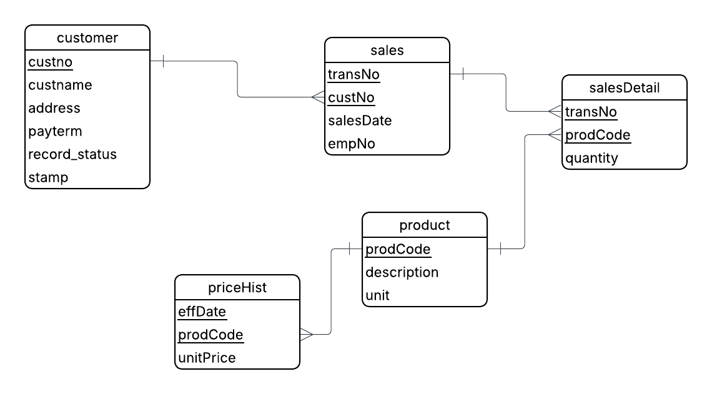

# 🏢 HOPE, INC. — Customer Management System (HopeCMS)

A full-stack Customer Management System built for **Hope, Inc.** as a Capstone Project for **New Era University**. This system manages customer lifecycles while providing read-only insights into historical sales and product data.

🔗 **Live Demo:** [https://hopecms.netlify.app](https://hopecms.netlify.app)

---

## 👥 The Team (M-Roles)

| Role | Name | Primary Responsibilities |
|------|------|--------------------------|
| **M1: Project Lead** | Alexis B. Pidlaoan | Sprint Planning, Release PRs, Lead Architect |
| **M2: Frontend Dev** | Xander G. Macayan | UI/UX, Customer Management Views, Components |
| **M3: DB Engineer** | Alvin M. Antonio Jr.| RLS Policies, SQL Views, Schema Migrations |
| **M4: Rights & Auth** | Charenze Jan N. Buenafe | RBAC Logic, Google OAuth, Module Access |
| **M5: QA / Docs** | Klein C. Balazon | Vitest Testing, Documentation, README Maintenance |

---

## 🛑 Core Rules (Mandatory Compliance)

These rules are **non-negotiable** and enforced at the database (RLS) and application levels:

- **No Hard Deletes** — The `DELETE` keyword is strictly prohibited. All customer removals are Soft-Deletes via `record_status = 'INACTIVE'`.
- **User Privacy** — `INACTIVE` customers are completely invisible to `USER` accounts in all lists, searches, and direct API calls.
- **Read-Only Integrity** — The `sales`, `salesDetail`, `product`, and `priceHist` tables are view-only for all roles. No addition or modification is permitted.
- **Superadmin Protection** — `ADMIN` roles cannot modify `SUPERADMIN` account rights or statuses.

---

## 📐 Database Architecture

The system operates on **5 core data tables** and a dedicated **RBAC (Role-Based Access Control)** schema.

### Entity Relationship Diagram (ERD)



> The schema ensures data integrity and strictly enforces the separation between CRUD-enabled customer data and historical sales records.

### Access Matrix (Rights Management)

| User Type | Customer CRUD | Sales/Product View | User Management |
|-----------|---------------|--------------------|-----------------|
| **SUPERADMIN** | Full (incl. Soft-Delete) | ✅ Yes | Full Control |
| **ADMIN** | Add/Edit (No Delete) | ✅ Yes | Activation Only |
| **USER** | View Active Only | ✅ Yes | ❌ None |

---

## 🛠 Tech Stack

| Layer | Technology |
|-------|------------|
| **Frontend** | React 19 (Vite) + Tailwind CSS v4 |
| **Backend** | Supabase (PostgreSQL) |
| **Auth** | Supabase Auth (Email + Google OAuth 2.0) |
| **Deployment** | Netlify |

---

## 🚀 Getting Started

### Prerequisites

- Node.js (v18 or higher)
- npm

### Installation

1. **Clone the repository:**
   ```bash
   git clone https://github.com/AlexisPidlaoan/HOPE-Customer_Management_System.git
   ```

2. **Install dependencies:**
   ```bash
   npm install
   ```

3. **Configure Environment:**

   Create a `.env` file in the root directory:
   ```env
   VITE_SUPABASE_URL=your_supabase_project_url
   VITE_SUPABASE_ANON_KEY=your_supabase_anon_key
   ```

4. **Run Development Server:**
   ```bash
   npm run dev
   ```

---

## 🔄 Git Workflow

We follow a strict branching strategy to ensure code stability:

- `main` — Production-ready code only.
- `dev` — Stable development base for integration.
- `feat/*`, `fix/*`, `db/*`, `test/*` — Feature-specific branches.

**The Flow:**
> Branch from `dev` → Create PR → Teammate Review → Merge to `dev` → Release PR to `main` at the end of the Sprint.

---

## 📝 Sprint Logs

### Sprint 1: Foundation
- Initial Supabase Schema & Migrations *(M3)*
- Authentication & Google OAuth 2.0 Setup *(M4)*
- Basic UI Shell and Customer Listing *(M2)*

### Sprint 2: Core Logic & Security
- Implementation of Soft-Delete logic & Deleted Customers Panel *(M1)*
- Detailed Sales History Drill-down *(M2)*
- 27-case Rights Test Matrix implementation *(M5)*

---

<div align="center">

**New Era University — College of Computer Studies**

*Information Management Course | AY 2025–2026*

</div>
