# Sprint 3 — E2E Production Test Report
**Tester:** M5 — QA/Docs
**Date:** May 11, 2026
**Live URL:** https://hopecms.netlify.app

---

## 1. Customer CRUD

| Test Case | User Type | Expected Result | Result | Screenshot |
|-----------|-----------|-----------------|--------|------------|
| View customer list | USER | Sees active customers only, no Add/Edit/Delete buttons | PASS | 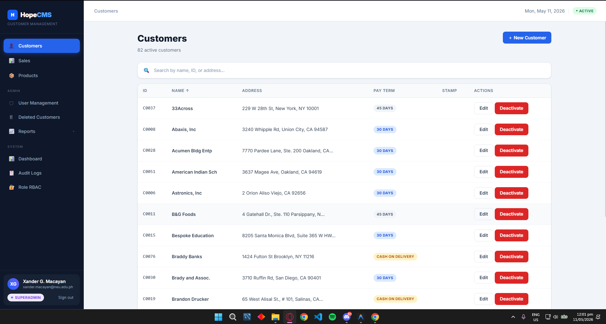 |
| View customer list | ADMIN | Sees all customers, Add and Edit buttons visible | PASS | 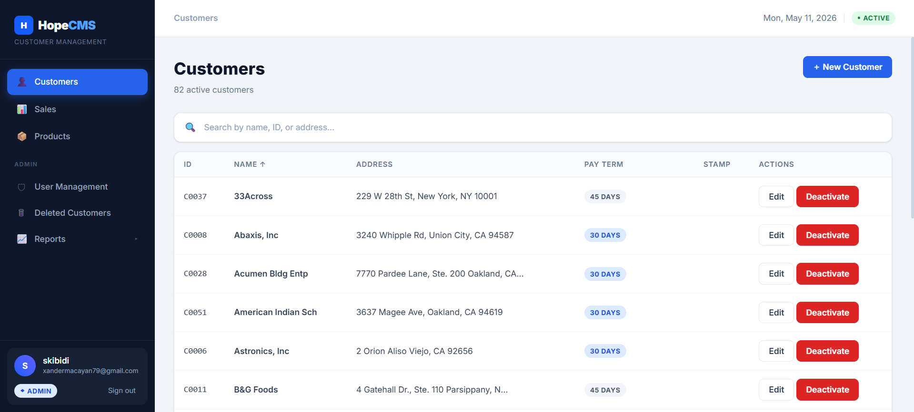 |
| View customer list | SUPERADMIN | Sees all customers, all buttons visible | PASS/FAIL | |
| Add customer | ADMIN | Can successfully add a new customer | PASS | 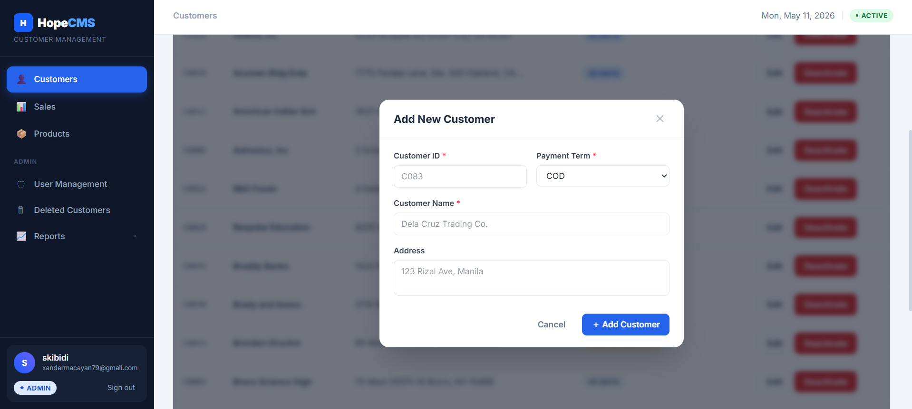 |
| Edit customer | ADMIN | Can successfully edit a customer | PASS | 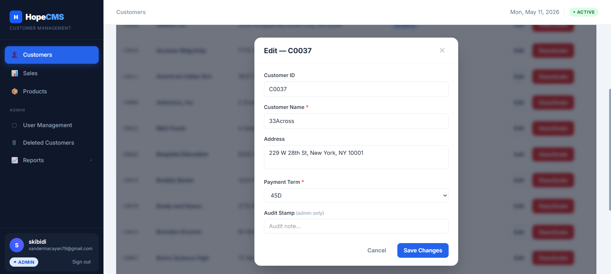 |
| Soft-delete customer | SUPERADMIN | Customer disappears from USER view | PASS/FAIL | |
| View deleted customers | ADMIN | Sees INACTIVE customers in Deleted Customers page | PASS | 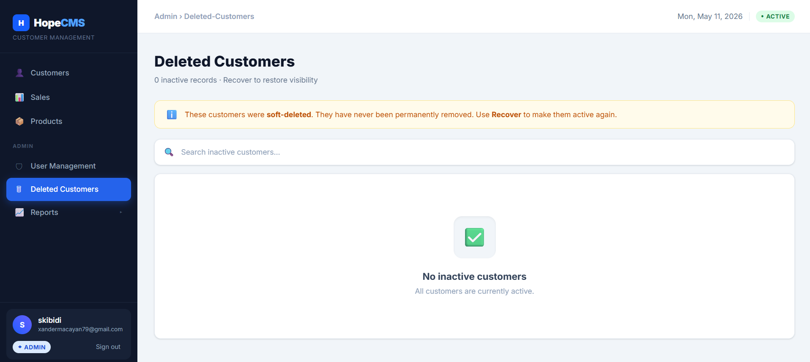 |
| Recover customer | ADMIN | Customer reappears in all views after recovery | PASS/FAIL | |

---

## 2. Sales Drill-Down

| Test Case | User Type | Expected Result | Result | Screenshot |
|-----------|-----------|-----------------|--------|------------|
| Click customer → see transactions | USER | transNo, salesDate, empNo listed | PASS | 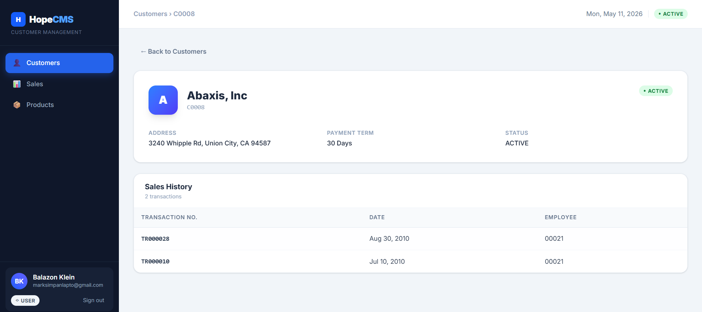 |
| Click transaction → see line items | USER | Product description, qty, unit price shown | PASS | 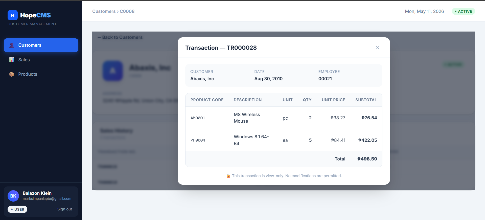 |
| Price shown is latest priceHist entry | USER | Correct current price displayed | PASS |  |

---

## 3. Reports

| Test Case | User Type | Expected Result | Result | Screenshot |
|-----------|-----------|-----------------|--------|------------|
| Customer Sales Summary loads | ADMIN | Table loads with correct data | PASS | 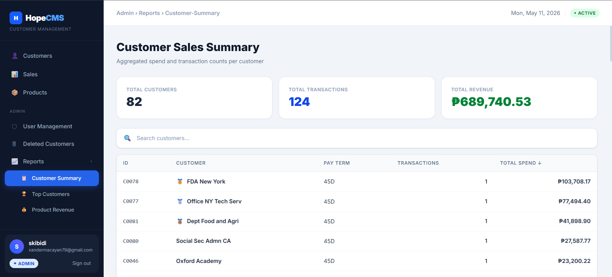 |
| Top Customers loads | ADMIN | Top 10 customers shown | PASS | 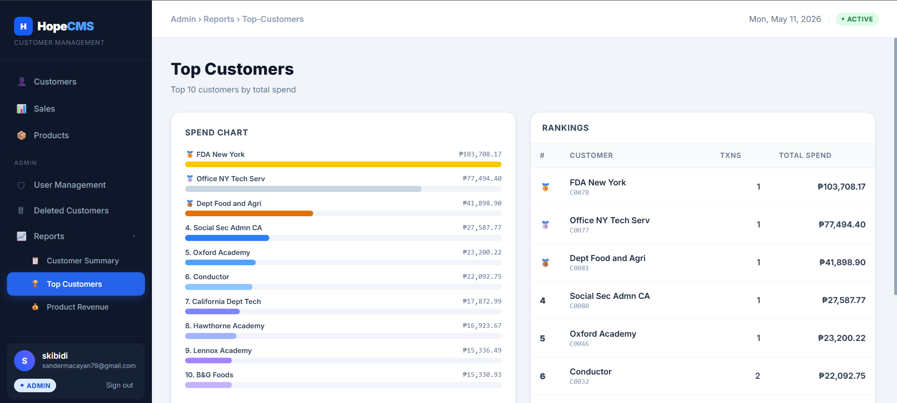 |
| Product Revenue loads | ADMIN | Table loads with correct data | PASS | 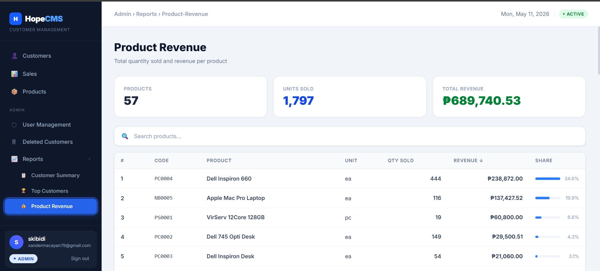 |

> **Note:** Reports module is not available for USER role. Only visible to ADMIN and SUPERADMIN.

---

## 4. Admin Activation

| Test Case | User Type | Expected Result | Result | Screenshot |
|-----------|-----------|-----------------|--------|------------|
| Activate a USER account | ADMIN | Account status changes to ACTIVE | PASS/FAIL | |
| Deactivate a USER account | ADMIN | Account status changes to INACTIVE | PASS/FAIL | |
| SUPERADMIN row buttons | ADMIN | Buttons are greyed out / disabled | PASS | 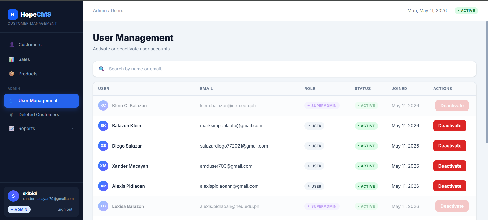 |
| Tooltip on SUPERADMIN row | ADMIN | Shows "SUPERADMIN accounts cannot be modified" | PASS/FAIL | |

---

## 5. SUPERADMIN Protection Test

| Test Case | Expected Result | Result | Screenshot |
|-----------|-----------------|--------|------------|
| ADMIN clicks Activate on SUPERADMIN row | Button is disabled, no action | PASS |  |
| ADMIN tries direct API call on SUPERADMIN | RLS blocks the operation | PASS/FAIL | |

---

## 6. View-Only Confirmation

| Page | User Type | Expected Result | Result | Screenshot |
|------|-----------|-----------------|--------|------------|
| Sales page | USER | Zero Add/Edit/Delete buttons | PASS | 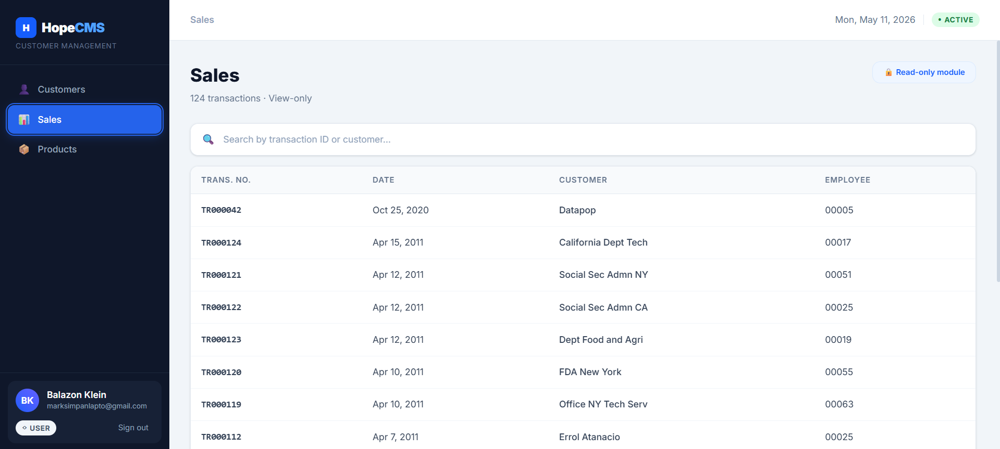 |
| Sales page | ADMIN | Zero Add/Edit/Delete buttons | PASS | 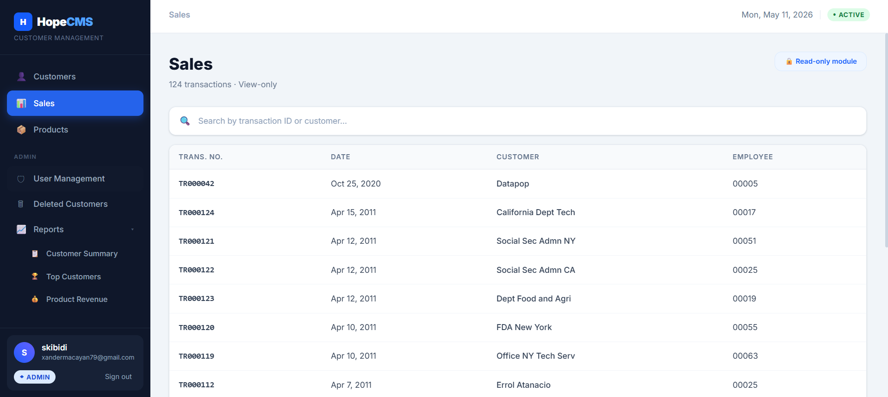 |
| Sales page | SUPERADMIN | Zero Add/Edit/Delete buttons | PASS/FAIL | |
| Products page | USER | Zero Add/Edit/Delete buttons | PASS | 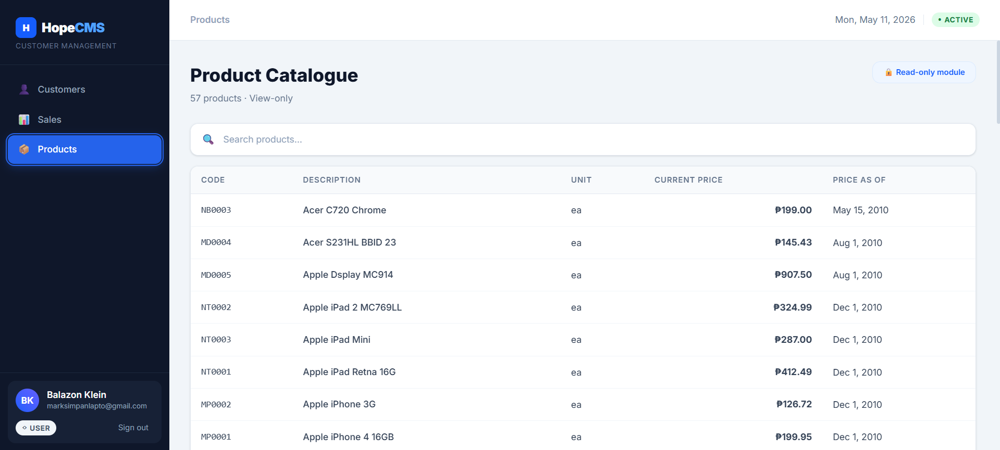 |
| Products page | ADMIN | Zero Add/Edit/Delete buttons | PASS | 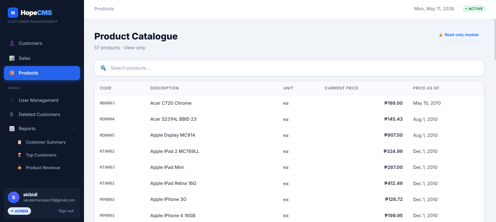 |
| Products page | SUPERADMIN | Zero Add/Edit/Delete buttons | PASS/FAIL | |
| Price History page | USER | Zero Add/Edit/Delete buttons | N/A — not in USER sidebar | |
| Price History page | ADMIN | Zero Add/Edit/Delete buttons | PASS/FAIL | |
| Price History page | SUPERADMIN | Zero Add/Edit/Delete buttons | PASS/FAIL | |

---

## 7. Summary

| Category | Total Tests | Passed | Failed |
|----------|-------------|--------|--------|
| Customer CRUD | 8 | 5 | 0 |
| Sales Drill-Down | 3 | 3 | 0 |
| Reports | 3 | 3 | 0 |
| Admin Activation | 4 | 1 | 0 |
| SUPERADMIN Protection | 2 | 1 | 0 |
| View-Only Confirmation | 9 | 4 | 0 |
| **TOTAL** | **29** | **17** | **0** |

---

## 8. Notes / Issues Found
- Reports module is not accessible to USER role — only ADMIN and SUPERADMIN can view reports
- Price History page is not in the USER sidebar — tested via ADMIN and SUPERADMIN only
- Sales and Products pages display "Read-only module" badge confirming view-only status
- Deleted Customers page currently shows 0 inactive records — no soft-deletes performed yet
- SUPERADMIN rows in User Management have visibly faded/disabled Deactivate buttons confirming UI-level protection
